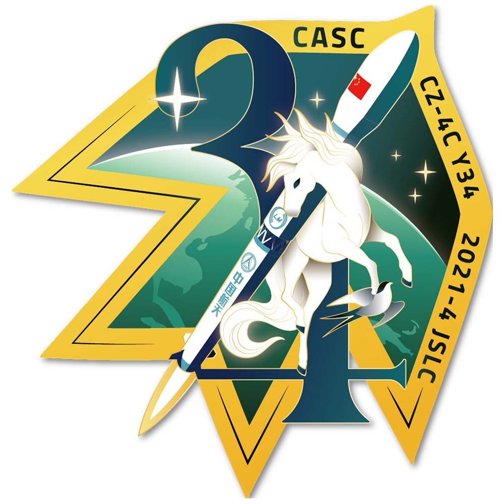

<table border="0" width=550px align="center" style="margin-bottom: 100px;">
  <tr>
  <td align="center" width=500px></td>
  </tr>
  <tr>
  <td align="center"><b> 遥感三十四号  （2021年04月30日）</b></td>
  </tr>
</table>

# **遥感三十四号** Yaogan 34

* 时间：2021年04月30日
* 载具：长征四号丙
* 载荷：遥感三十四号卫星
* 来源：[上海航天公众号](https://mp.weixin.qq.com/s/kGAdsqreu8JTfjkDlflr4A) 
* 信息：[上海航天公众号](https://mp.weixin.qq.com/s/kGAdsqreu8JTfjkDlflr4A) 

