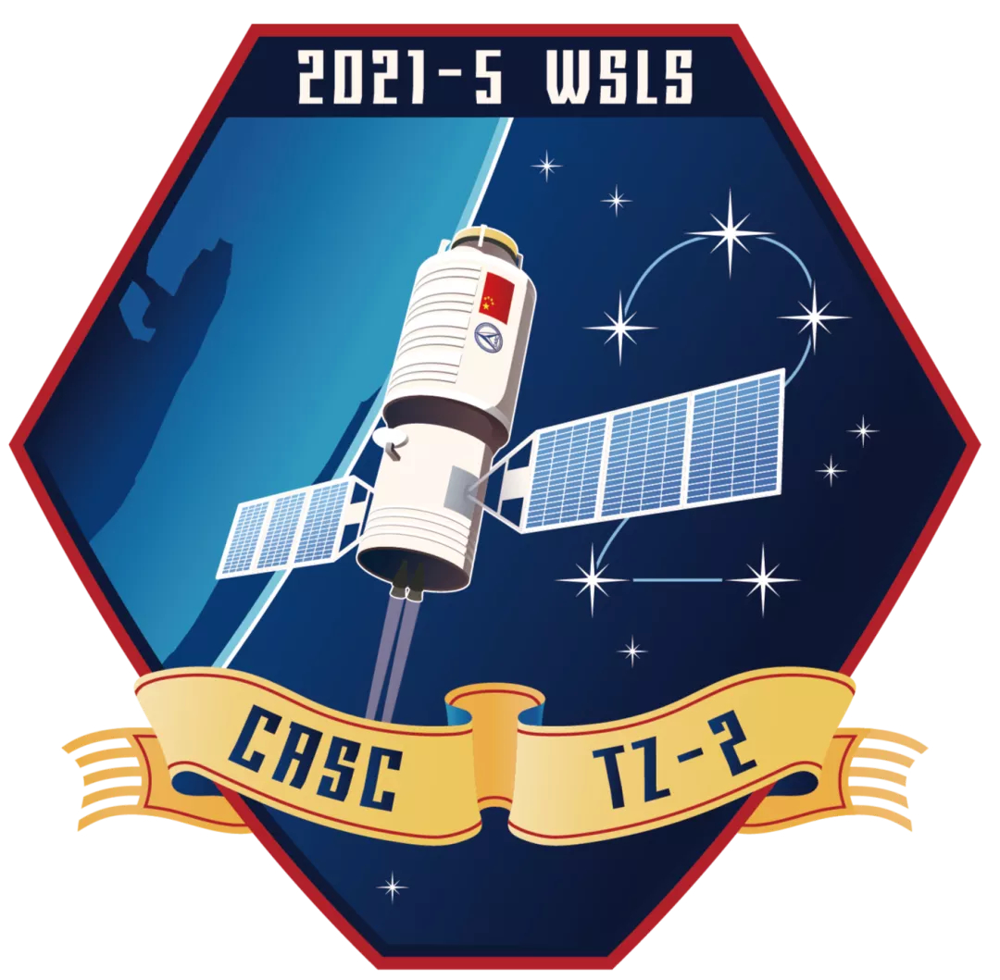
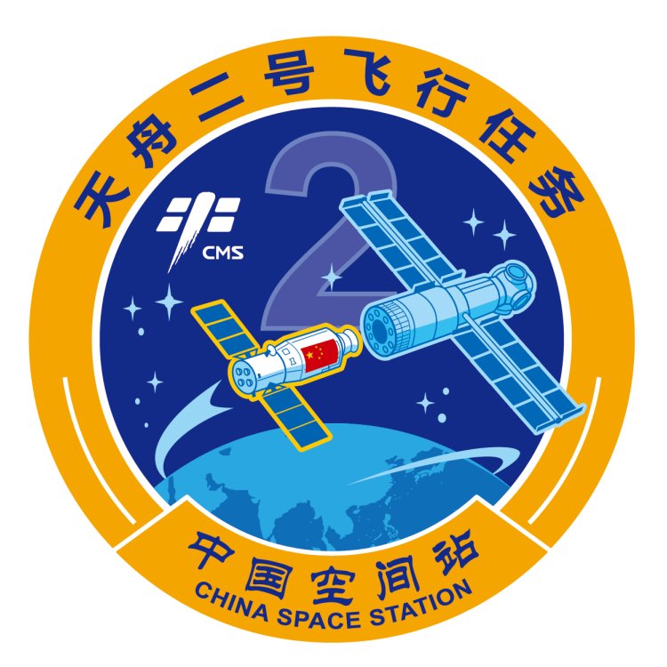

<table border="0" width=550px align="center" style="margin-bottom: 100px;">
  <tr>
  <td align="center" width=500px></td><td align="center" width=500px></td>
  </tr>
  <tr>
  <td align="center"><b> 天舟二号  （2021年05月29日）</b></td><td align="center"><b> 天舟二号  （2021年05月29日）</b></td>
  </tr>
</table>

# **天舟二号** Tianzhou 2

* 时间：2021年05月29日
* 载具：长征七号遥三
* 载荷：天舟二号
* 来源：[China航天](https://weibo.com/5616492130/KhKKlaGS2) [百度百科](https://baike.baidu.com/item/%E5%A4%A9%E8%88%9F%E4%BA%8C%E5%8F%B7/24695456) 
* 信息：[百度百科](https://baike.baidu.com/item/%E5%A4%A9%E8%88%9F%E4%BA%8C%E5%8F%B7/24695456) 

