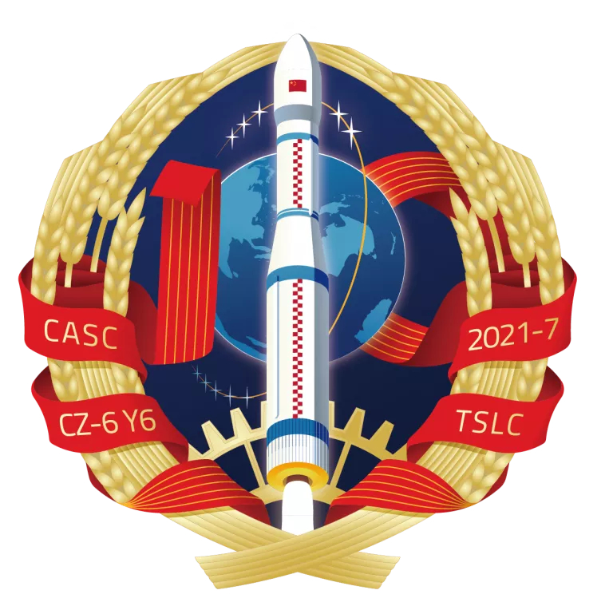

<table border="0" width=550px align="center" style="margin-bottom: 100px;">
  <tr>
  <td align="center" width=500px></td>
  </tr>
  <tr>
  <td align="center"><b> 钟子号卫星星座02星  （2021年07月09日）</b></td>
  </tr>
</table>

# **钟子号卫星星座02星** Zhongzi-02

* 时间：2021年07月09日
* 载具：长征六号
* 载荷：钟子号卫星星座02星
* 来源：[中国航天CASC B站](https://t.bilibili.com/545453798559265049?tab=2) 
* 信息：[中国航天CASC B站](https://t.bilibili.com/545453798559265049?tab=2) 

