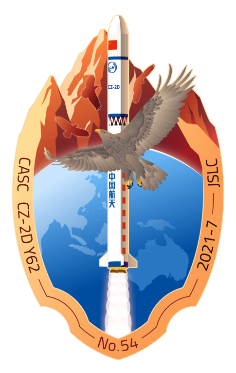

<table border="0" width=550px align="center" style="margin-bottom: 100px;">
  <tr>
  <td align="center" width=500px></td>
  </tr>
  <tr>
  <td align="center"><b> 天绘一号04星  （2021年07月29日）</b></td>
  </tr>
</table>

# **天绘一号04星** Tianhui-1D

* 时间：2021年07月29日
* 载具：长征二号丁
* 载荷：天绘一号04星
* 来源：[上海航天公众号](https://mp.weixin.qq.com/s/9BVOWzP6onBrilx4v-AYOg) 
* 信息：[上海航天公众号](https://mp.weixin.qq.com/s/9BVOWzP6onBrilx4v-AYOg) [长二丁维基百科](https://en.wikipedia.org/wiki/Long_March_2D) 

