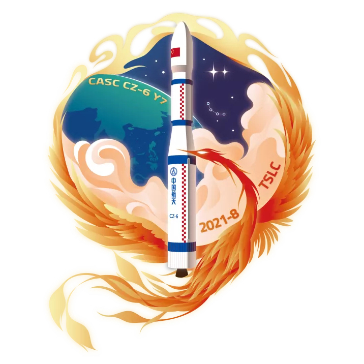

<table border="0" width=550px align="center" style="margin-bottom: 100px;">
  <tr>
  <td align="center" width=500px></td>
  </tr>
  <tr>
  <td align="center"><b> 多媒体贝塔试验A/B卫星  （2021年08月04日）</b></td>
  </tr>
</table>

# **多媒体贝塔试验A/B卫星** KL-Beta A/B

* 时间：2021年08月04日
* 载具：长征六号遥七
* 载荷：多媒体贝塔试验A/B卫星
* 来源：[中国航天CASC](https://t.bilibili.com/555088982161464358?tab=2) 
* 信息：[长征六号维基百科](https://zh.wikipedia.org/wiki/长征六号运载火箭) 

