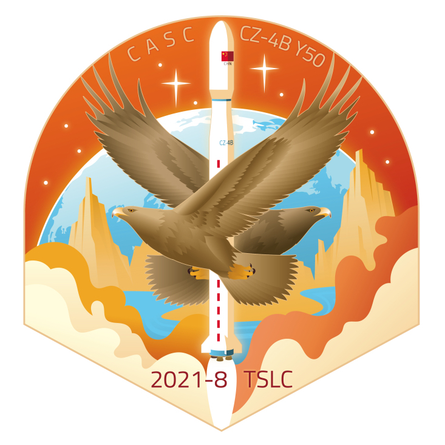

<table border="0" width=550px align="center" style="margin-bottom: 100px;">
  <tr>
  <td align="center" width=500px></td>
  </tr>
  <tr>
  <td align="center"><b> 天绘二号02星  （2021年08月19日）</b></td>
  </tr>
</table>

# **天绘二号02星** Tianhui 2-02

* 时间：2021年08月19日
* 载具：长征四号乙
* 载荷：天绘二号02星
* 来源：[中国航天CASC B站](https://t.bilibili.com/560465594016725015?tab=2) 
* 信息：[中国航天CASC B站](https://t.bilibili.com/560465594016725015?tab=2) 

